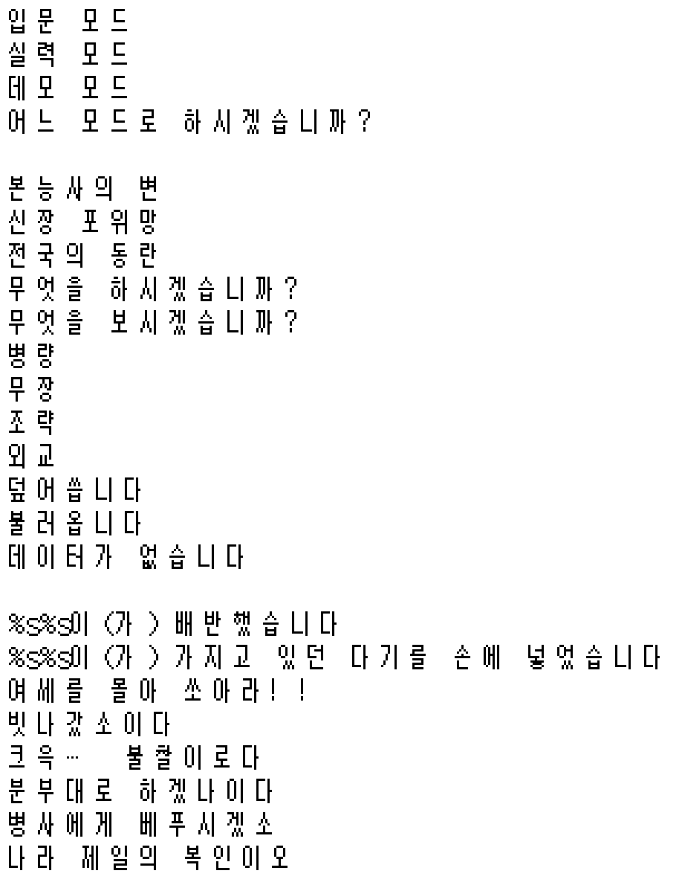

# 노부나가의 야망 (GBA) 한국어 패치

<p align="center">
  
</p>

GBA용 『信長の野望』(KOEI, 2001 / 롬 코드 `ANBJ`)의 **비공식 한국어 팬 번역 패치**입니다.
게임 텍스트 **7,138개 문자열 전체**를 한국어로 번역하고, 12×12 비트맵 폰트에 한글 글리프 787자를 주입했습니다.

도구·번역 데이터·폰트·문서까지 **패치를 처음부터 다시 만들 수 있는 일체**가 들어 있습니다.
`python build_patch.py` 한 줄이면 배포본과 **바이트 단위로 동일한** 롬이 재현됩니다.

> **롬 파일은 포함되어 있지 않습니다.** 본인이 소유한 정품 롬이 필요합니다.

---

## 빠른 시작

**그냥 한글로 플레이하고 싶다면** — [Releases](https://github.com/snake7594/gba-nobunaga-korean-patch/releases) 에서 `Nobunaga_Korean.xdelta` 를 받아 원본 롬에 적용하세요.

```
xdelta3 -d -s "Nobunaga no Yabou (Japan).gba" Nobunaga_Korean.xdelta "Nobunaga no Yabou (Korean).gba"
```

**직접 빌드하고 싶다면** — 원본 롬을 `rom/` 폴더에 넣고:

```
pip install -r requirements.txt
python build_patch.py
```

GUI 사용법·문제 해결·번역 수정 방법은 **[docs/패치방법.md](docs/패치방법.md)** 에 자세히 적어 두었습니다.

| 항목 | 값 |
|---|---|
| 원본 MD5 | `2d1ceffbc8c34e3101ab91ea49f43a44` |
| 패치본 MD5 | `9d0fc1753c1cd3b9c6819b15aac6200f` |
| 크기 | 4,194,304 바이트 (원본과 동일 — 플래시카트 그대로 사용 가능) |

---

## 패치 내용

| 항목 | 수치 |
|---|---|
| 번역된 문자열 | **7,138개** |
| 원문 분량 | SJIS 143 KB / 고유 문자열 3,332종 |
| 주입한 한글 글리프 | **787자** (갈무리11, 12×12 픽셀) |
| 제자리 기록 / 재배치 | 5,753 / 1,354 |
| 오버플로·잘림 | **0건** |

번역 범위:

- 타이틀·모드 선택·난이도 등 **시스템 메뉴**
- 내정 / 군사 / 인사 / 외교 / 거래 전 **커맨드 메뉴와 도움말**
- 합전·평정·이벤트 **대사 전체** (사투리 대사 포함)
- **인물 열전** 수백 건, 시나리오 해설, 다기(茶器) 설명
- 세이브·로드·통신 대전 등 **시스템 메시지**

### 번역 방침

| 대상 | 방침 | 예 |
|---|---|---|
| 인명·지명·성(城)·구니(国) | 한자 독음 + 두음법칙 | 織田信長 → 직전신장, 龍造寺 → 용조사, 六角 → 육각 |
| 게임 용어 | 용어집 통일 | 大名 → 다이묘, 足軽 → 아시가루, 一揆 → 잇키 |
| 가나 표기 고유명사 | 외래어 표기법 음차 | ぬらりひょん → 누라리횬 |
| 가신 → 주군 대사 | 사극체 | ~하옵니다 / ~이옵니다 / ~하시오소서 |
| 나레이션·인물 열전 | 평서체 | ~했다 / ~이다 |
| 시스템 메시지 | 경어체 | ~합니다 / ~하시겠습니까? |

용어집·독음표는 [`data/glossary.json`](data/glossary.json), 원문↔번역 전체 대조는
[`data/번역대조표.txt`](data/번역대조표.txt) 에 있습니다.

---

## 저장소 구성

```
build_patch.py        ← 이것만 실행하면 패치 롬이 만들어집니다
requirements.txt

rom/                  원본 롬을 두는 곳 (비어 있음 — 직접 준비)
patch/                배포용 xdelta 패치
images/               샘플 이미지

tools/                패치 제작 도구 (18개)
data/                 번역 데이터 · 문자열 DB · 용어집 · 대조표
font/                 갈무리11 BDF + OFL 라이선스
docs/                 패치 방법 · 롬 구조 분석 · 작업 과정
analysis/             폰트를 찾아낸 조사 스크립트 (38개, 실패 기록 포함)
```

### 주요 데이터 파일

| 파일 | 내용 |
|---|---|
| `data/tr_merged.json` | **번역 원본** — 고칠 곳은 여기입니다 |
| `data/번역대조표.txt` | 원문↔번역 전체 대조 (사람이 읽는 용도) |
| `data/master_strings.json` | 롬에서 추출한 문자열 DB (주소·길이·여유·포인터) |
| `data/units2.json` | 번역 단위 (독음 자동변환 / 단일 / 시퀀스) |
| `data/unsafe_offsets.json` | 포인터 진위 미확인 목록 — 재배치 금지 대상 |
| `data/charmap.json` | 한글 음절 ↔ 폰트 슬롯 대응 |
| `data/폰트슬롯표.txt` | 위 대응표를 사람이 읽는 형태로 |
| `data/tr_batches/`, `data/tr_out/` | 번역 작업 단위와 그 결과 (54쌍) |

---

## 기술 구조

### 롬 내부 배치

| 항목 | 주소 | 설명 |
|---|---|---|
| 본문 폰트 12×12 | `0x305274` | 글리프당 **18바이트** (행당 12비트 패킹, MSB=왼쪽), 1,869자 |
| 문자 매핑 테이블 | `0x30D6CE` | u16 LE **SJIS 오름차순** 1,869개 |
| 렌더러(이진 탐색) | `0x08003620` | SJIS 코드 → 슬롯 인덱스 |
| ASCII 폰트 8×12 | `0x304DF4` | 96자, 12바이트/자 |
| 재배치 텍스트 영역 | `0x33A1A0` ~ `0x356788` | 원본 패딩 구간, 116 KB 사용 |

텍스트는 **평문 Shift-JIS**이며 LZ77 등 압축은 쓰이지 않습니다.

### 한글 주입 방식

이 게임은 SJIS 코드를 매핑 테이블에서 이진 탐색해 슬롯 번호를 얻고,
그 슬롯의 비트맵을 그립니다. 따라서 **매핑 테이블을 건드리지 않고**
기존 한자·가나 슬롯의 **글리프 이미지만 한글로 교체**하면
게임 코드를 전혀 수정하지 않고도 한글이 출력됩니다.

```
"한" ──▶ 슬롯 218 배정 ──▶ 0x305274 + 218×18 에 '한' 비트맵 기록
                          └─ 원래 이 슬롯의 SJIS 코드(阿, 0x88A2)를 그대로 재사용
텍스트에는 0x88A2 를 기록 ──▶ 게임이 이진 탐색 ──▶ 슬롯 218 ──▶ '한' 출력
```

- 한자 1,633 + 히라가나 71 + 가타카나 78 = **1,782 슬롯** 사용 가능, 실제 787자 사용
- 기호·전각 숫자·영문 69자는 원본 유지 (`、。「」（）０-９Ａ-Ｚ` 등)
- 가이지(외자) 18자는 `{G00}`~`{G17}` 토큰으로 보존

**이 방식의 대가**: 한자·가나 슬롯이 한글로 바뀌므로 번역문에 일본어를 남기면
엉뚱한 글자가 출력됩니다. 주입 전에 반드시 검사합니다 (`tools/validate2.py`).

### 문자열 재배치와 포인터 안전성

번역문이 원래 자리에 안 들어가면 롬 끝 패딩 영역으로 옮기고 포인터를 갱신합니다.
**가짜 포인터를 고치면 게임이 깨지므로** 모든 참조의 진위를 역추적했습니다.

| 판정 근거 | 개수 |
|---|---|
| 포인터 배열 소속 (이웃 워드도 유효 포인터) | 2,159 |
| Thumb `LDR Rd,[PC,#imm]` 리터럴 풀 역추적 성공 | 585 |
| **미확인** | 21 |

미확인 21개는 **재배치 금지**로 표시해, 포인터를 건드리지 않는 제자리 기록만 허용했습니다.

자세한 내용은 [docs/ROM구조.md](docs/ROM구조.md), [docs/작업과정.md](docs/작업과정.md) 참고.

---

## 검증

`python build_patch.py` 를 돌리면 아래 검증이 자동으로 실행됩니다.

| 검사 | 도구 | 결과 |
|---|---|---|
| 게임과 동일한 조회 로직으로 전수 대조 | `verify_all.py` | 7,107개 **불일치 0** |
| 코드 영역 변경 분석 | `code_diff.py` | 494워드 전부 의도한 포인터 갱신, **미설명 변경 0바이트** |
| DB 고정 필드 침범 | `field_check.py` | **0건** (5건이 2바이트 증가했으나 전부 패딩 내) |
| 포인터 무결성 | `verify_all.py` | 이상 **0건** |
| 롬 헤더·크기 | `verify_all.py` | 무변경 |
| 에뮬레이터 실행 | 수동 | mGBA 0.10.5 정상 구동 |

**의도적으로 제외한 20건**은 대조 대상에서 빠집니다.

- *겹침 오검출 8건* — 추출기가 진짜 문자열 **안쪽**을 새 문자열로 오인한 경우.
  실제 포인터를 가진 쪽이 정상 번역되므로 게임 표시에는 영향이 없습니다.
- *표현 불가 12건* — 바이너리 데이터가 문자열로 잘못 추출된 조각. 원본 바이트를 보존합니다.

주입기(`inject.py`)와 검증기(`verify_all.py`)는 **같은 판단 모듈**(`tools/plan.py`)을 씁니다.
서로 다른 기준을 쓰면 정상인데 불일치로 잡히는 착시가 생기기 때문입니다.

---

## 도구

전부 Python 3 + Pillow 만 있으면 동작합니다.

| 순서 | 스크립트 | 하는 일 |
|---|---|---|
| — | `paths.py` | 경로 해석 (롬 위치 탐색, `build/` 우선 읽기) |
| — | `plan.py` | **주입 계획** — 주입기·검증기가 공유하는 판단 로직 |
| 1 | `master_extract2.py` | 롬 전체에서 SJIS 문자열 추출 |
| 2 | `build_units2.py` | 포인터 배열로 시퀀스 재구성, 독음 자동변환 분리 |
| 3 | `build_batches.py` | 번역 배치 + 용어집 생성 |
| 4 | *(번역)* | [`tools/TRANSLATE_INSTRUCTIONS.md`](tools/TRANSLATE_INSTRUCTIONS.md) 지침에 따라 |
| 5 | `merge_tr.py` | 배치 결과 병합 |
| 6 | `validate2.py` | 포맷 코드·금지문자·바이트 제한 검증 |
| 7 | `ptr_confirm.py` | 포인터 진위 역추적 |
| 8 | `inject.py` | 폰트 글리프 + 번역 텍스트 주입 |
| 9 | `verify_all.py` | 전수 재검증 |
| 10 | `make_patch.py` | xdelta 패치 생성 (xdelta3 없으면 내장 인코더 사용) |

보조: `code_diff.py`(코드 변경 분석) `field_check.py`(필드 침범 검사)
`sample_sheet.py`(샘플 이미지) `font_preview.py`(폰트 미리보기)
`verify_final.py`(임의 주소 렌더) `hangul_codec.py`(인코더) `bdf.py`(BDF 파서)
`eumdok.py`(한자 1,624자 독음표)

`analysis/` 에는 폰트를 찾아낸 조사 스크립트 38개가 실패 기록까지 포함해 들어 있습니다
([analysis/README.md](analysis/README.md)).

---

## 알려진 제한

- **히라가나 이름 입력 그리드**는 원본 유지 — 한 글자 단위 UI라 한글 조합이 불가능합니다.
- 바이너리 데이터가 문자열로 오인 추출된 조각 12건은 원본 바이트를 보존했습니다.
- 인물 열전 등 일부 문장은 전각 폭 제약 때문에 압축된 표현을 썼습니다.
- 고유명사는 일본어 발음이 아닌 **한자 독음**입니다 (직전신장 ≠ 오다 노부나가).
  이 시리즈 한글패치의 관례를 따랐습니다.

---

## 라이선스와 출처

| 대상 | 라이선스 |
|---|---|
| 이 저장소의 도구·스크립트 | MIT ([`LICENSE`](LICENSE)) |
| 갈무리11 폰트 | SIL Open Font License 1.1 ([`font/Galmuri-LICENSE.txt`](font/Galmuri-LICENSE.txt)) |
| 게임 원본 텍스트·데이터 | © KOEI — 본 저장소는 롬을 포함하지 않습니다 |

- 갈무리 폰트: [quiple/galmuri](https://github.com/quiple/galmuri) (v2.40.3)
- 이 패치는 팬 번역이며 코에이테크모와 무관합니다. 정품 롬 소유자 본인의 사용만을 전제로 합니다.

## 기여

번역 오류나 표시 깨짐을 발견하시면 이슈로 알려주세요.
`data/번역대조표.txt` 의 해당 줄이나 게임 내 화면을 함께 남겨 주시면 수정이 빠릅니다.
